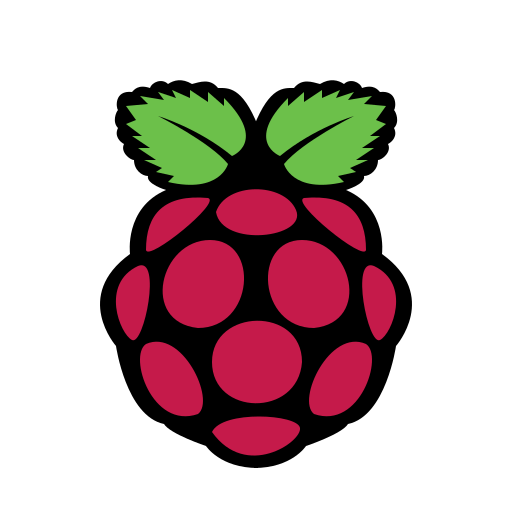

## :open_book: About  
I am a student at Western University studying Mechatronic Systems Engineering and Honours Business Administration.

## :man_scientist: Socials

## :man_technologist: Languages & Tools

## :juggling_person: Interests
r/Bitcoin, r/Multicopter, r/Minecraft, r/Dogecoin, r/Investing, r/3Dprinting, r/Mechanicalkeyboard
